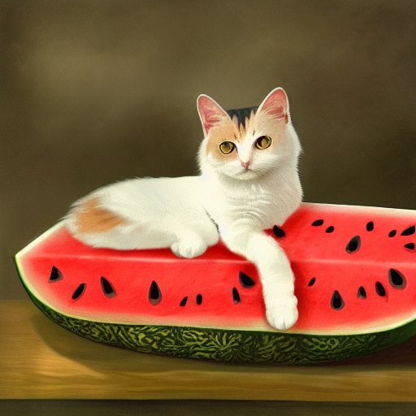
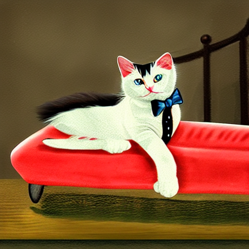

# Creating a Stable Diffusion Model from Scratch
Learning how to create stable diffusion from the ground up beginning with Variational Autoencoders, CLIP, Denoising UNet, DDPM scheduler, etc. The inspiration here was so I could
understand what is happening under the hood when I implement it myself for future projects.
<br><br>

# Results
## Text-to-Image Result
**Prompt**: "calico cat, loafing, large watermelon bed, cartoon"



## Image-to-Image Result
**Input Image:** Using the text-to-image result above.<br>
**Noise Strength**: 0.6<br>
**Prompt**: "Calico cat wearing a tuxedo, cartoon"


<br><br>

# Citations
I'd like to thank Umar Jamil youtube channel for the amazing break-downs and guides on Transformers and Diffusion models. A lot of the content here was inspired from his videos and all I've done
was just simplify it further so I can understand it better in my own words along with diving deeper with my own research. Check him out at [Umar Jamil](https://www.youtube.com/@umarjamilai).

https://github.com/CompVis/stable-diffusion/
```
@InProceedings{Rombach_2022_CVPR,
    author    = {Rombach, Robin and Blattmann, Andreas and Lorenz, Dominik and Esser, Patrick and Ommer, Bj\"orn},
    title     = {High-Resolution Image Synthesis With Latent Diffusion Models},
    booktitle = {Proceedings of the IEEE/CVF Conference on Computer Vision and Pattern Recognition (CVPR)},
    month     = {June},
    year      = {2022},
    pages     = {10684-10695}
}
```