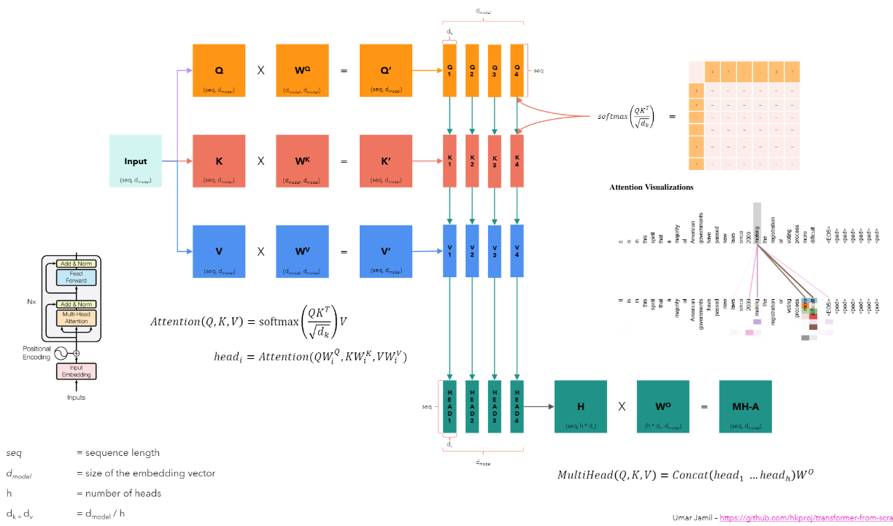

# Table of Contents

1. [How Stable Diffusion Works](#how-stable-diffusion-works)
   1. [What is it?](#What-is-a-generative-model?)
      - [Marginalizing a variable](#marginalizing-a-variable)
      - [Evaluating conditional probability](#Evaluating-conditional-probablity)
   2. [Forward and Reverse Process](#forward-and-reverse-process)
      - [Forward Process](#forward-process)
      - [Reverse Process](#reverse-process)
      - [ELBO Loss Function in Training the Reverse Process](#elbo-loss-function-in-training-the-reverse-process)
   3. [Training Loop](#training-loop)
   4. [Denoising U-Net](#denoising-u-net)
2. [Algorithms](#algorithms)
   1. [Classifier Guidance](#classifier-guidance)
   2. [Classifier-Free Guidance](#classifier-free-guidance)
3. [CLIP Encoder](#clip-encoder)
4. [Auto Encoder](#auto-encoder)
   1. [Variational Auto Encoder (VAE)](#variational-auto-encoder-vae)
   2. [Latent Diffusion Model](#latent-diffusion-model)
5. [Full Architecture Combined](#full-architecture-combined)
   1. [Text-To-Image](#text-to-image)
   2. [Image-To-Image](#image-to-image)
   3. [Inpainting](#inpainting)
6. [Layers](#layers)
   1. [Layer Normalization](#layer-normalization)
   2. [Group Normalization](#group-normalization)

# How Stable Diffusion Works
## What is a generative model?
A generative model learns the probability distribution of a data set (images in this case) and can generate entirely new images by sampling from this distribution.

Data is modeled as distributions to be able to evaluate probabilities using conditional probability of continuous random variables (CRV). However, there is an importance on the type of distribution we use. See the example below of a normal Gaussian distribution, let's say we toss a coin for each variable (age and height). We end up with an improbable statistic of a 3 year old with a height of 130 cm. 


To solve this problem, we can use a probability density function (PDF). The Gaussian distribution is already a specific type of PDF but rather than a forced symmetric bell-curve shape around the mean, the shape will just depend on the total area of 1. This area under the PDF curve represents the probability that the variable falls within that interval. The function is f*X*(*x*) for a random variable *X*. 

In the example above, since we have two variables, we can create a **Joint Probability Distribution** graph that describes the probability distribution of the two CRVs, f*X,Y*(*x,y*) which gives the probability density at the point (*x,y*). This new graph allows us to have more a plausible statistic between age and height because the two variables of age and height now have a probability score associated with it.


Instead of evaluating each variable independently (tossing a coin for each variable), the joint distribution considers the relationship between the variables. The heatmap shown above indicates that closer to the center is a higher probability and farther is lower, representing the probability density of the two variables. With this joint distribution graph, we can evaluate probability using conditional probability or marginalizing.

***Why is this important with an image dataset?*** Well this is actually what's happening for an image, we create a very complex distribution where each pixel is a CRV and each of these pixels are joined in one big joint distribution graph. 
<br>

### Marginalizing a variable

To further analyze the relationship between age and height, we can marginalize one of the variables. Marginalizing a variable means integrating out that variable to obtain the marginal distribution of the remaining variable. For example, to find the marginal distribution of age, we integrate the joint probability density function over all possible values of height:

<pre>
f<sub>Age</sub>(a) = ∫<sub>-∞</sub><sup>∞</sup> f<sub>Age, Height</sub>(a, h) dh
</pre>

Similarly, to find the marginal distribution of height, we integrate the joint probability density function over all possible values of age:

<pre>
f<sub>Height</sub>(h) = ∫<sub>-∞</sub><sup>∞</sup> f<sub>Age, Height</sub>(a, h) da
</pre>

By marginalizing one of the variables, we can understand the distribution of the other variable independently, while still accounting for their joint relationship. In simpler terms, this means we can find out how common one variable is without considering the other variable. For example, we can determine the most common ages without worrying about heights, or the most common heights without worrying about ages.

**Real-World Example**: Imagine you have a table of data with ages and heights of children. If you want to know the overall distribution of ages without considering height, you would look at the marginal distribution of age. This tells you how common each age is, regardless of height. Similarly, the marginal distribution of height tells you how common each height is, regardless of age.
<br>

### Evaluating conditional probablity

To evaluate the probability of one variable given another, we use **conditional probability**. Conditional probability tells us the probability of one variable given that we know the value of another variable. For example, to find the probability of a certain height given a specific age, we use the formula:

<pre>
f<sub>Height|Age</sub>(h|a) = f<sub>Age, Height</sub>(a, h) / f<sub>Age</sub>(a)
</pre>

This formula means we take the joint probability of age and height and divide it by the marginal probability of age. In simpler terms, this allows us to determine the probability of a certain height given a specific age. For example, if we know a person is 130 cm tall, we can use this formula to find out the probability of different ages for a person of that height. This helps us understand the relationship between age and height more clearly.

**Real-World Example**: If you want to know the probability of a child being 130 cm tall given that they are 10 years old, you would use the joint distribution of age and height and divide it by the marginal distribution of age. This gives you the conditional probability of height given age.
<br><br>


## Forward and Reverse Process: An Overview of DDPM

The Denoising Diffusion Probabilistic Model (DDPM) consists of two main processes: the forward process and the reverse process. These processes are described using probabilistic terms and formulas that involve key concepts such as distributions, mean, and variance.

In the forward process, we gradually add noise to an image, while in the reverse process, we attempt to remove this noise. Both processes are modeled using probability distributions, specifically Gaussian (normal) distributions.

Key concepts to understand:

1. Probability distributions: These describe the likelihood of different outcomes using Probability Density Functions (PDFs). In DDPM, we use Gaussian (Normal) distributions to model the noise addition and removal processes.
   - Mathematical concept: PDFs represent the relative likelihood of a random variable taking on a given value. For Gaussian distributions, this is a bell-shaped curve.
   - Relation to DDPM: In the forward process, PDFs model how pixel values change as noise is added. In the reverse process, they model the likelihood of pixel values during denoising.
   - Example: The distribution of pixel values in a noisy image.
   - Importance: Allows us to quantify uncertainty and randomness in the diffusion process.
   - Usage: In the forward process, q(x_t | x_0) is modeled as a Gaussian distribution. In the reverse process, p_θ(x_t-1 | x_t) is also modeled as a Gaussian.

2. Mean (μ): The average or expected value of a distribution. In DDPM formulas, the mean often represents the "signal" part of an image.
   - Mathematical concept: The center point of a distribution, representing the typical or average value.
   - Relation to DDPM: In the forward process, the mean shifts towards zero as more noise is added. In the reverse process, the mean is estimated to recover the original image signal.
   - Example: In q(x_t | x_0), √(α̅_t) * x_0 represents the mean.
   - Importance: Helps maintain some of the original image information throughout the process.
   - Usage: In the reverse process, the mean μ_θ(x_t, t) is predicted by the neural network to guide the denoising.

3. Standard deviation (σ): The square root of the variance, measuring the spread of data around the mean. In DDPM, it represents the magnitude of noise.
   - Mathematical concept: A measure of how spread out the values are from the mean. Larger values indicate more spread.
   - Relation to DDPM: In the forward process, the standard deviation increases as more noise is added. In the reverse process, it decreases as noise is removed, guiding the image restoration.
   - Example: In q(x_t | x_0), √(1 - α̅_t) represents the standard deviation.
   - Importance: Directly quantifies the amount of noise added or removed at each step.
   - Usage: Used in both forward and reverse processes to control the amount of noise added or removed.

4. Variance (σ²): A measure of spread in a distribution. In DDPM, variance often represents the "noise" part of an image.
   - Mathematical concept: The average squared deviation from the mean, indicating how far a set of numbers are spread out.
   - Relation to DDPM: In the forward process, variance increases with each step, representing increasing noise. In the reverse process, reducing variance guides the denoising, helping to recover the original image structure.
   - Example: In q(x_t | x_0), (1 - α̅_t) * I represents the variance.
   - Importance: Controls the amount of noise added or removed at each step.
   - Usage: In the reverse process, the variance Σ_θ(x_t, t) is often fixed or learned to control the stochasticity of the generation.

5. Gaussian noise (ε): Random noise sampled from a standard normal distribution, used to add randomness to the process.
   - Example: ε in the formula x_t = √(α̅_t) * x_0 + √(1 - α̅_t) * ε.
   - Importance: Introduces controlled randomness, allowing for diverse image generation.
   - Usage: Added to images in the forward process and predicted/removed in the reverse process.

6. Noise schedule (β): A sequence of values that control how much noise is added at each step of the forward process.
   - Example: β_t in α_t = 1 - β_t.
   - Importance: Ensures a gradual and controlled transition from the original image to pure noise.
   - Usage: Defines the forward process and influences the reverse process design.

7. Neural network (p_θ): Used in the reverse process to predict and remove noise.
   - Example: The model that learns to estimate ε given x_t.
   - Importance: Enables the model to learn the complex mapping from noisy to clean images.
   - Usage: In the reverse process, it predicts the noise to be removed at each step, guiding the image generation.

Understanding these concepts will help in comprehending the detailed explanations of the forward and reverse processes that follow, including the specific formulas used to model noise addition and removal.


The system is modeled as a joint distribution with the inclusion of latent variables, represented by variable *Z* in the image above. This latent space allows the model to capture complex relationships and features in the data.
<br>

---

### Forward Process
We begin with the initial image, denoted as x<sub>0</sub>. In the forward process of diffusion models, we continuously add noise to this image over a series of time steps from 1 to T where x<sub>T</sub> is pure noise. At each time step t, noise is added to the image, resulting in a progressively noisier image. This can be modeled as a *Markov chain*.

The forward process in the DDPM (Denoising Diffusion Probabilistic Model) is denoted by q and involves adding noise to an image. The formula for transitioning from time step t-1 to t is as follows:

<pre>
q(x<sub>t</sub> | x<sub>t-1</sub>) = √(α<sub>t</sub>) * x<sub>t-1</sub> + √(1 - α<sub>t</sub>) * ε
</pre>

- q(x<sub>t</sub> | x<sub>t-1</sub>): "Transitioning from step t-1 to t" or "Given an image that has less noise (t-1), how do we get to more noise (t)".
- x<sub>t</sub>: The image at time step t.
- x<sub>t-1</sub>: The image at the previous time step (t-1).
- α<sub>t</sub>: The simplified version of 1 - β<sub>t</sub>, where β<sub>t</sub> is the variance schedule. α<sub>t</sub> is a value between 0 and 1 that decreases over time, controlling the amount of original image information retained at each step.
- ε: Gaussian noise sampled from a normal distribution N(0, I), representing the random noise added to the image.

As you can see from above how this this process is ***Markovian*** since the next state depends only on the previous state x<sub>t-1</sub> and some added noise.

***Note: In DDPM, α<sub>t</sub> = 1 - β<sub>t</sub>, where β<sub>t</sub> is the variance schedule that increases over time. This means that as the diffusion process progresses, more noise is added to the image at each step. The increasing variance schedule allows for a gradual transition from the original image to pure noise, with later steps introducing more significant changes. This approach helps in creating a smooth and controlled degradation of the image during the forward process, which is crucial for the effectiveness of the reverse process in image generation.***

Additionally, the formula for transitioning from the original image (x<sub>0</sub>) to any noisified image (x<sub>t</sub>) in one step is:

<pre>
q(x<sub>t</sub> | x<sub>0</sub>) = N(√(α̅<sub>t</sub>) * x<sub>0</sub>, (1 - α̅<sub>t</sub>) * I)
</pre>

This formula represents a Gaussian distribution from which we can sample x<sub>t</sub>:

- q(x<sub>t</sub> | x<sub>0</sub>): "Transitioning from original image to any noisy step t image".
- N(μ, σ²): Denotes a normal distribution with mean μ and variance σ².
   - The mean (μ) of this distribution is √(α̅<sub>t</sub>) * x<sub>0</sub>, and the variance (σ²) is (1 - α̅<sub>t</sub>) * I.
- α̅<sub>t</sub> is the cumulative product of the noise schedule up to time step t.
- I: Identity matrix, representing the covariance structure.

To sample from this distribution, we can use the reparameterization trick:

<pre>
x<sub>t</sub> = √(α̅<sub>t</sub>) * x<sub>0</sub> + √(1 - α̅<sub>t</sub>) * ε
</pre>

Where ε is sampled from a standard normal distribution N(0, I). This allows us to add noise to the original image in a way that's consistent with the forward process of the diffusion model.
<br>

---

### Reverse Process
The reverse process in DDPM aims to gradually remove noise from a noisy image x<sub>t</sub> to obtain a less noisy image x<sub>t-1</sub>. This process is modeled by a neural network, denoted as p<sub>θ</sub> (p theta), which learns to predict the distribution of the previous time step's image given the current noisy image.

In the implementation for this project, the model is designed to predict the noise (ε<sub>θ</sub>) rather than directly predicting the mean and variance of the distribution. This approach aligns with the DDPM paper and allows for a more efficient computation. The reverse process is described by the following equations:

***Note again that: In DDPM, α<sub>t</sub> = 1 - β<sub>t</sub>***

---

**Equation (11) from the DDPM paper:**
<pre>
p<sub>θ</sub>(x<sub>t-1</sub> | x<sub>t</sub>) = N(x<sub>t-1</sub>; μ<sub>θ</sub>(x<sub>t</sub>, t), Σ<sub>θ</sub>(x<sub>t</sub>, t))
</pre>

Importance: Used to sample the denoised latent image x<sub>t-1</sub> by adding a small amount of random noise to the computed mean.

Where:
- p<sub>θ</sub>(x<sub>t-1</sub> | x<sub>t</sub>): "Transitioning from noisy image x<sub>t</sub> to less noisy image x<sub>t-1</sub>".
- N: A normal distribution.
- μ<sub>θ</sub>(x<sub>t</sub>, t): The mean of the distribution, representing the most likely value for x<sub>t-1</sub>.
- Σ<sub>θ</sub>(x<sub>t</sub>, t): The variance of the distribution, representing the uncertainty in the prediction of x<sub>t-1</sub>.
<br><br>

---

**Equation (15) from the DDPM paper:**
<pre>
x<sub>0</sub> = (x<sub>t</sub> - √(1 - α̅<sub>t</sub>) * ε<sub>θ</sub>(x<sub>t</sub>, t)) / √(α̅<sub>t</sub>)
</pre>

Importance: Crucial for computing the predicted original sample (pred_original_sample). It allows the model to estimate the clean image from the noisy input and the predicted noise, which is essential for guiding the denoising process towards the desired output.

Where:
- x<sub>0</sub>: The predicted original, noise-free image.
- x<sub>t</sub>: The current noisy image.
- α̅<sub>t</sub>: The cumulative product of (1 - β<sub>t</sub>) up to time step t, representing how much of the original signal is preserved.
- ε<sub>θ</sub>(x<sub>t</sub>, t): The noise predicted by the neural network for the current step.
<br><br>

---

**Equation (7) from the DDPM paper:**
<pre>
μ<sub>θ</sub>(x<sub>t</sub>, t) = (√(α̅<sub>t-1</sub>)β<sub>t</sub> / (1 - α̅<sub>t</sub>)) * x<sub>0</sub> + (√(α<sub>t</sub>)(1 - α̅<sub>t-1</sub>) / (1 - α̅<sub>t</sub>)) * x<sub>t</sub>
</pre>
Importance: Used to compute the predicted previous sample mean (pred_prev_sample). Determines how to combine the information from the current noisy image and the estimated clean image to produce the best guess for the less noisy image at the previous time step.

Where:
- μ<sub>θ</sub>(x<sub>t</sub>, t): The mean of the distribution for x<sub>t-1</sub>, representing the best guess for the less noisy image.
- α<sub>t</sub>: The noise schedule parameter at time step t, where α<sub>t</sub> = 1 - β<sub>t</sub>.
- β<sub>t</sub>: The variance schedule parameter at time step t, controlling how much noise is added at each step.
- (√(α̅<sub>t-1</sub>)β<sub>t</sub> / (1 - α̅<sub>t</sub>)): The coefficient for x<sub>0</sub>, which determines how much weight is given to the predicted original image.
- (√(α<sub>t</sub>)(1 - α̅<sub>t-1</sub>) / (1 - α̅<sub>t</sub>)): The coefficient for x<sub>t</sub>, which determines how much weight is given to the current noisy image.

Additionally, equation (7) is used to compute the variance β̅<sub>t</sub> (beta bar t) for the reverse process:

<pre>
β̅<sub>t</sub> = (1 - α̅<sub>t-1</sub>) / (1 - α̅<sub>t</sub>) * β<sub>t</sub>
</pre>

This variance term is crucial for determining the amount of noise to add during the reverse process, ensuring that the denoising steps are consistent with the forward diffusion process. The variance β̅<sub>t</sub> helps maintain the balance between the information from the current noisy image and the predicted clean image, allowing for a smooth and controlled denoising process.
<br><br>

---

In the code implementation, these equations are used in a specific order due to their interdependencies and computational requirements:

1. First, we compute x<sub>0</sub> using equation (15). This step is crucial because:
   a) Our model predicts the noise ε<sub>θ</sub>(x<sub>t</sub>, t) rather than directly predicting the mean and variance.
   b) We need to estimate x<sub>0</sub> to proceed with the next steps, as it's used in the calculation of the mean μ<sub>θ</sub>(x<sub>t</sub>, t).
   c) Without this step, we wouldn't have the pred_original_sample (x<sub>0</sub>) needed for subsequent calculations.

2. Then, we use equation (7) to compute the mean μ<sub>θ</sub>(x<sub>t</sub>, t) and the variance β̅<sub>t</sub>. This order is necessary because:
   a) The equation requires the predicted x<sub>0</sub> from step 1 and the current noisy image x<sub>t</sub>.
   b) We couldn't compute this without first estimating x<sub>0</sub>, as it's a key component in the equation.
   c) The coefficients pred_original_sample_coeff and current_sample_coeff are calculated using values from step 1.
   d) The variance β̅<sub>t</sub> is computed using the same parameters: β̅<sub>t</sub> = (1 - α̅<sub>t-1</sub>) / (1 - α̅<sub>t</sub>) * β<sub>t</sub>
   e) This variance term is crucial for determining the amount of noise to add during the reverse process.

3. Finally, we sample from the distribution described by equation (11) to get x<sub>t-1</sub>. This step comes last because:
   a) It requires the mean μ<sub>θ</sub>(x<sub>t</sub>, t) computed in step 2.
   b) We need to add a small amount of random noise to the computed mean, which depends on the variance calculated from previous steps.
   c) The variance calculation (if t > 0) uses the _get_variance method, which in turn depends on values computed in earlier steps.

The equation used to sample from the distribution (derived from equation 11):
<pre>
x<sub>t-1</sub> = μ<sub>θ</sub>(x<sub>t</sub>, t) + σ<sub>t</sub> * z
</pre>
Where σ<sub>t</sub> (sigma_t) is the standard deviation computed from the variance Σ<sub>θ</sub>(x<sub>t</sub>, t), and z is random noise sampled from a standard normal distribution.

This approach allows us to efficiently compute the reverse process using the noise prediction from our model, without needing to explicitly predict the mean and variance of the distribution. It's derived from the properties of the forward process and the relationship between the added noise and the image at each step, as described in the DDPM paper.

The reverse process remains Markovian, as the next state (x<sub>t-1</sub>) depends only on the current state (x<sub>t</sub>) and not on any previous states. This Markov property simplifies the modeling and allows each step to be treated independently given the current state.
<br>

---

#### ELBO Loss Function in Training the Reverse Process
In training the neural network to learn the reverse process, we use the Evidence Lower Bound (ELBO) loss. The ELBO loss helps in approximating the true distribution of the data by maximizing a lower bound on the data likelihood. This process helps the neural network learn to denoise the images accurately.

The ELBO can be broken down into two main parts:
1. The reconstruction term, which measures how well the model can reconstruct the original image from the noisy image.
2. The regularization term, which ensures that the learned distribution is close to a predefined prior distribution.

By maximizing the ELBO, we ensure that the neural network learns to generate images that are both accurate and consistent with the prior distribution.

First we start by maximizing the log likelihood of our data by marginalizing over all other latent variables. Then we find a lower bound for the log likelihood, that is log(p<sub>θ</sub>(x<sub>0</sub>)) >= ELBO. As you can see, maximizing the ELBO also indirectly maximizes the log likelihood of the data.

In summary, the ELBO loss provides a way to train the neural network for the reverse process by balancing the reconstruction accuracy and the regularization, ensuring that the generated images are both realistic and consistent with the prior distribution.

##### Real-World Analogy
Consider a real-world scenario where a company's revenue is always greater than or equal to its sales. If we aim to maximize the sales, the revenue will naturally increase as well. Similarly, by maximizing the ELBO, we are indirectly maximizing the likelihood of the observed data, leading to better performance of the neural network in the reverse process.
<br><br>

## Algorithms

## Training Loop


In simpler terms, the training loop for Denoising Diffusion Probabilistic Models (DDPM) involves the following steps:

1. **Sample an Image**: We start by taking a sample image (or batches) from our dataset, denoted as x<sub>0</sub>.
2. **Select a Random Time Step**: We randomly choose a time step t from a uniform distribution between 1 and T.
3. **Generate Random Noise**: We generate random noise ε (epsilon) from a normal distribution with mean 0 and variance 1.
4. **Add Noise to the Image**: We add the generated noise to the image (or each images) at time step *t* using the formula:
   <pre>
   x<sub>t</sub> = √(α̅<sub>t</sub>) * x<sub>0</sub> + √(1 - α̅<sub>t</sub>) * ε
   </pre>
   Here, α̅<sub>t</sub> is a predefined noise schedule that controls the amount of noise added at each time step.
5. **Train the Model**: We train the neural network to predict the noise added to the image by minimizing the difference between the actual noise and the predicted noise. This is done using gradient descent on the loss function:
   <pre>
   ∇<sub>θ</sub> || ε - ε<sub>θ</sub>(√(α̅<sub>t</sub>) * x<sub>0</sub> + √(1 - α̅<sub>t</sub>) * ε, t) ||<sup>2</sup>
   </pre>
   Here, ε<sub>θ</sub> is the noise predicted by the neural network, and θ represents the parameters of the neural network. Remember that theta comes from the reverse process.
   
   The formula can be broken down as follows:
   - ε: The actual noise added to the image.
   - ε<sub>θ</sub>(√(α̅<sub>t</sub>) * x<sub>0</sub> + √(1 - α̅<sub>t</sub>) * ε, t): The noise predicted by the neural network given the noisy image and the time step t.
   - ε<sub>θ</sub>: The model as it represents the neural network's prediction of the noise, parameterized by θ.
   - || ε - ε<sub>θ</sub>(...) ||<sup>2</sup>: The squared difference between the actual noise and the predicted noise, which we aim to minimize.
   - ∇<sub>θ</sub>: The gradient with respect to the neural network parameters θ, used for updating the model during training.

   Simplified, the goal is to adjust the neural network parameters θ so that the predicted noise ε<sub>θ</sub> closely matches the actual noise ε. By minimizing this loss, we are able to maximize the ELBO, ensuring the neural network learns to denoise the images effectively.
6. **Repeat Until Convergence**: We repeat the above steps until the model converges, meaning the predictions become accurate enough.

By following these steps, the model learns to denoise images step by step, starting from pure noise and gradually reconstructing the original image.
<br><br>

## Denoising U-Net


The U-Net architecture processes the image through three main paths: downsampling, bottleneck, and upsampling. Here's a simplified explanation of how the image moves through the U-Net:

1. **Downsampling Path (Encoder)**:
   - The noisy image enters the U-Net and passes through a series of convolutional layers.
   - Each layer reduces the spatial dimensions (width and height) while increasing the number of channels.
   - This process captures increasingly abstract features of the image.
   - The image's representation becomes more compact but richer in information.

2. **Bottleneck**:
   - The image reaches its most compressed form at the bottom of the 'U'.
   - Here, the model processes the most abstract representation of the image.
   - This is where the model can make global decisions about the image content.

3. **Upsampling Path (Decoder)**:
   - The process reverses, gradually increasing spatial dimensions and decreasing channel depth.
   - Skip connections from the downsampling path provide additional context.
   - These connections help preserve fine details that might have been lost during downsampling.
   - The image is progressively reconstructed, removing noise at each step.

Throughout this process, the U-Net is working in the latent space, which is a compressed representation of the image. This latent space can be thought of as a high-dimensional vector where each dimension represents a particular feature or attribute of the image. The U-Net's job is to move the noisy image's position in this latent space towards a position that represents a clean, noise-free version of the image.

---

### Conditioning the Reverse Process (Training)

From the training loop algorithm, the loss function contains the model ε<sub>θ</sub>. This model will be built using a denoising U-Net.

In the reverse process of the training loop, the denoising U-Net plays a crucial role in removing the noise added to the images at each time step. By predicting the noise component ε<sub>θ</sub>, the U-Net helps in reconstructing the image step by step, gradually refining it to resemble the original image or a target prompt. 

Now that we are able to predict the noise, we need a way to guide images that align with specific prompts or conditions since the model won't know what we want as output if we are starting off from pure noise in the reverse process. There are two main approaches to achieve this: classifier guidance and classifier-free guidance.
<br>

---

##### Classifier Guidance

In classifier guidance, an additional classifier is trained to predict the class or attributes of an image. This classifier is then used to guide the reverse process:

1. **Classifier Training**: A separate classifier is trained on the dataset to recognize specific classes or attributes. (E.g. CLIP Encoder)
2. **Gradient-based Guidance**: During the reverse process, the gradient of the classifier's output with respect to the image is used to steer the denoising process towards the desired class or attributes.
3. **Iterative Refinement**: At each denoising step, the U-Net's output is adjusted based on the classifier's gradient, pushing the image towards the desired outcome.

---

##### Classifier-Free Guidance

Classifier-free guidance eliminates the need for a separate classifier. Instead, it utilizes a single network trained to handle both conditioned and unconditioned generation.

**Training Process**:
1. **Dual Learning**: During training, the model learns to process both conditioned and unconditioned inputs. This dual approach is crucial for several reasons:
   - Conditioned inputs (with text prompts) teach the model to generate images that align with specific descriptions.
   - Unconditioned inputs (with null or empty prompts) allow the model to learn general image generation without specific guidance.
   - By alternating between these, the model becomes versatile, capable of both following prompts and generating diverse, unprompted images.
   - This approach prevents over-reliance on conditioning, ensuring the model can still generate coherent images even with vague or absent prompts.

2. **Unified Network**: The same network learns to handle both conditioned and unconditioned generation, which is important because:
   - It creates a more efficient and flexible model that can adapt to various input types.
   - The shared knowledge between conditioned and unconditioned generation allows for better generalization.
   - It enables the model to understand the relationship between text prompts and image features more comprehensively.

**Inference Process**:
In Stable Diffusion, the classifier-free guidance approach involves two separate inference passes, each serving a distinct purpose:

1. **Conditioned Inference**: 
   - Uses the specified text prompt (e.g., "generate a cat").
   - Guides the generation towards the desired output.
   - This pass ensures that the generated image aligns with the given prompt, incorporating specific features or concepts described in the text.

2. **Unconditioned Inference**: 
   - Uses an empty or null text prompt.
   - Represents a more general, unguided generation.
   - This pass allows the model to generate based on its learned understanding of image structure and content, without specific textual constraints.
   - It acts as a baseline, representing what the model would generate without any guidance.

3. **Guidance Scale**: A parameter that balances the influence of conditioned and unconditioned outputs.
   - It allows fine-tuning of how closely the final image adheres to the prompt versus how much it relies on the model's general image generation capabilities.

4. **Output Combination**: The final output is a weighted combination of conditioned and unconditioned predictions.
   - By combining these two outputs, the model can generate images that are both prompt-relevant and visually coherent.
   - This combination helps in reducing artifacts or over-fitting to the prompt, resulting in more natural-looking images.

The use of both conditioned and unconditioned inferences during the generation process allows for a balance between prompt adherence and image quality, enabling the creation of diverse, high-quality images that can be finely controlled through text prompts.

The classifier-free guidance formula is typically expressed as:

z<sub>guided</sub> = z<sub>uncond</sub> + w * (z<sub>cond</sub> - z<sub>uncond</sub>)

Where:
- z<sub>guided</sub> is the final guided output
- z<sub>uncond</sub> is the unconditioned output (from the empty prompt inference)
- z<sub>cond</sub> is the conditioned output (from the specified prompt inference)
- w is the guidance scale (weight)

The guidance scale w controls the prompt's influence:
- w = 0: Purely unconditioned output (ignores the prompt)
- w = 1: Balanced mix of conditioned and unconditioned outputs
- w > 1: Emphasizes the conditioned output, potentially leading to stronger prompt adherence but possibly less diverse results

Adjusting the guidance scale allows fine-tuning of the generation process, balancing between prompt adherence and image quality or diversity.

It's important to note that while the unconditioned prompt (often an empty text) guides the model to produce a more general output, it's not a direct "negative prompt" system. The difference between conditioned and unconditioned outputs is what steers the generation towards or away from specific features. This approach allows for nuanced control over the generated content without explicitly defining what not to include.
<br><br>

## CLIP Encoder


To be able to condition and guide the denoising U-Net to an image using a prompt, we use something called a CLIP (Contrastive Language-Image Pre-training) Encoder. The encoder will embed (vectors that represent the meaning) a text prompt and an image prompt into a shared latent space. This helps understand the meaning of images using descriptions.

In the example above, you can see Image of *I* from 1 to N is matched with the descriptions of Text *T* from 1 to N. The matrix is built by the dot product of the Image *I* per row from 1 to N multiplied with all of the text embeddings. It is trained by a loss function that maximizes the value of the diagonal matches (blue squares) while the rest of the values are 0 (grey squares). The model will be able to learn to match the description of an image with the image itself. 

For stable diffusion, only the text encoder will be used to embed the text prompt. In this case, the U-Net will use the embeddings as conditioning signals to guide the image to look like the prompt in each denoising step (see the reverse process).  
<br>

---

### Clip Architecture


The CLIP encoder architecture, specifically the text encoder part, is based on the Transformer architecture. It's designed to process and understand text inputs in the context of image-text relationships. Here's a breakdown from the CLIP architecture image:

1. Input Layer: 
   - Receives a sequence of text tokens (words or subwords).
   - Converts these tokens into vector embeddings.

2. Positional Encoding:
   - Adds positional information to each token embedding.
   - This helps the model understand the order of words in the input.

3. Transformer Layers (Nx):
   - Multiple layers of self-attention and feed-forward networks.
   - Each layer includes:
     a. Layer Normalization:
        - Applied before the self-attention for stable learning.
     b. Self-Attention mechanism:
        - Processes input through multi-head attention.
        - Has a residual connection that adds the input directly to the attention output.
     c. Layer Normalization:
        - Applied before the feed-forward network.
     d. Feed-Forward Network:
        - Further processes the normalized attention output.
        - Uses QuickGELU activation function instead of normal GELU.
        - QuickGELU (x * sigmoid(1.702 * x)) is faster to compute than standard GELU.
        - Another residual connection adds the input from before the feed-forward network.
   - These layers help the model capture complex relationships between words.
   - The use of residual connections (arrows in the picture above that points to layer normalization blocks) allows for better gradient flow and easier training of deeper networks.

4. Output:
   - The final layer normalization produces an embedding that represents the semantic meaning of the input text.

The residual connections in each Transformer layer allow the model to maintain a direct path for information flow, helping to mitigate the vanishing gradient problem and enabling the training of deeper networks. They also allow the model to easily learn identity functions, which can be crucial for preserving important information throughout the network.

In our Stable Diffusion setup:
- We only use the text encoder part of CLIP.
- The image encoding is handled separately by the VAE.
- The text embeddings from CLIP are used to guide the U-Net in creating images that match the text description.
- The U-Net uses these text embeddings as a conditioning signal during the denoising process.

This separation allows for more efficient and specialized processing: CLIP handles text understanding, VAE manages image encoding, and the U-Net focuses on the guided image generation process.

# TODO: Textual Inversion (how it can be fine tuned)

<br><br>


## Auto Encoder


The autoencoder is a network that given an image will transform into a vector (*Z*) that is much smaller than the original image. Think of it as compressing a file into a zip folder. When we pass the vector through the decoder it will re-build the original image back.

The problem with autoencoders is that the code learned by the model has no sense to it. It does not capture any semantic relationships between the data. We can keep assigning vectors to the input and the code does not find any pattern associated with the images. For example, we may end up seeing that an image of a cat is very close together in vector space with an image of a pizza. 
<br>

---

### Variational Auto Encoder (VAE)


To solve the problems of autoencoder we introduce a variational autoencoder, so rather the model learning code, we learn something called a ***latent space***. The latent space represents the parameters of a multivariate or joint distribution. From here we are able to capture semantic relationships between images. The embeddings in the vector space will be close together with vectors that closely match each other such as animals, food, buildings, etc.
<br>

---

### Latent Diffusion Model

Stable Diffusion is a latent diffusion model (LDM), from what was mentioned in the beginning, a generative model learns the distribution p(x) of a dataset of images. However, an LDM learns the distribution of a *latent* representation of the dataset by using a Variational Autoencoder (VAE).

VAE will help reduce the computation complexity by compressing the images of the dataset from lets say a 512x512 image to a latent representation that is 64x64. We can do this for all batches of images which creates a multivariate distribution that we can sample from within the latent space of the VAE.
<br><br>


## Full Architecture Combined
### Text-To-Image


The full architecture of the text-to-image process in Latent Diffusion Models (LDMs) can be broken down into the following simplified steps:

1. Text Encoding (CLIP Text Encoder):
   - The input text prompt is processed by the CLIP Text Encoder.
   - This encoder converts the text into a latent representation that captures its semantic meaning.

2. Random Noise Generation (VAE):
   - A random noise tensor is sampled from the latent space (*Z*) using the VAE.
   - The latent space in the VAE represents a multivariate distribution, capturing semantic relationships between different types of images.
   - This means that the noise tensor is generated by sampling from a distribution that has learned to represent various image features such as animals, food, buildings, etc.
   - This serves as the starting point for the image generation process.

3. Denoising Process (U-Net and Sampler):
   - The U-Net, which is the core of the diffusion model, iteratively denoises the latent representation.
   - It takes four inputs:
     a. The noisy latent image
     b. The timestep (indicating the level of noise)
     c. The encoded text prompt from step 1
     d. The Sampler's current parameters such as time embeddings
   - The U-Net uses self-attention and cross-attention mechanisms during the denoising process:
     - Self-attention: Allows the model to consider relationships between different parts of the image itself.
     - Cross-attention: Enables the model to align the image generation with the text prompt.
   - In each denoising step, self-attention helps refine image details by relating different image regions, while cross-attention guides the process using the text embeddings.
   - The U-Net predicts the noise to be removed at each step, guided by both attention mechanisms.
   - The Sampler then plays a crucial role in the denoising process:
     - It takes the noise prediction from the U-Net and updates the noisy latent image with less noise.
     - It determines the step size and noise level for each iteration, potentially skipping steps (e.g., from 1000 to 980).
     - The Sampler implements the specific diffusion algorithm, such as DDPM, DDIM, or others.
     - It manages the trade-off between speed and quality by controlling the number and size of denoising steps.
     - The Sampler also handles any additional techniques like classifier-free guidance, adjusting the noise prediction based on the guidance scale.
   - This process continues iteratively until the Sampler determines that the image has been sufficiently denoised.

4. Conditioning and Guidance:
   - The text embeddings from the CLIP Text Encoder guide the denoising process through cross-attention.
   - This ensures that the generated image aligns with the input text prompt.
   - The Sampler may adjust the strength of this guidance based on its parameters.
   - Remember that the denoising process could change depending if its classifier guidance or classifier-free guidance.

5. Latent Space to Image (VAE Decoder):
   - Once the denoising process is complete, the final latent representation is passed through the VAE Decoder.
   - The VAE Decoder converts the latent representation back into a full-resolution image.

Key components:
- CLIP Text Encoder: Processes the input text prompt
- U-Net: Performs the iterative denoising in latent space, utilizing self-attention and cross-attention
- VAE Decoder: Converts the final latent representation to an image
- Sampler: Manages the denoising process, controlling noise levels, step sizes, and implementing the specific diffusion algorithm

This process combines the efficiency of working in a compressed latent space (thanks to the VAE) with the power of diffusion models and the semantic understanding provided by CLIP. The Sampler plays a vital role in orchestrating the denoising process, balancing speed and quality while implementing the core diffusion algorithm.
<br>

---

### Image-To-Image


The image-to-image process in Latent Diffusion Models (LDMs) follows a similar architecture to the text-to-image process, with some key differences. Here's a simplified breakdown of the steps:

1. Image Encoding (VAE):
   - The input image is processed by the VAE Encoder. (differs with text-to-image where its just a random noisy latent image)
   - This encoder converts the image into a latent representation in the compressed latent space.

2. Text Encoding (CLIP Text Encoder):
   - If there's an accompanying text prompt, it's processed by the CLIP Text Encoder.
   - This step is similar to the text-to-image process, converting text into a semantic latent representation.

3. Noise Addition to Image Encoding (VAE):
   - Instead of starting with pure random noise, the encoded latent input image is partially noised.
   - The amount of noise added depends on the strength parameter, allowing for varying degrees of transformation. 
   - The more noise we add, the model has more freedom to alter the image.
   - The less noise we add, the model has less freedom since we wont be able change the input image dramatically.

4. Denoising Process (U-Net and S):
   - The U-Net performs iterative denoising on the noisy latent image.
   - It takes four inputs:
     a. The noisy latent image
     b. The timestep (indicating the level of noise)
     c. The encoded text prompt (if provided)
     d. The S's current parameters
   - The U-Net uses self-attention and cross-attention mechanisms during the denoising process:
     - Self-attention: Allows the model to consider relationships between different parts of the image itself, helping to maintain coherence and structure from the input image.
     - Cross-attention: Enables the model to align the image generation with the text prompt (if provided) and the features of the input image.
   - In each denoising step:
     - Self-attention helps refine image details by relating different image regions, preserving relevant features from the input image.
     - Cross-attention guides the process using both the text embeddings (if available) and the latent representation of the input image.
   - The U-Net predicts the noise to be removed at each step, guided by both attention mechanisms.
   - The S then plays a crucial role in the denoising process:
     - It takes the noise prediction from the U-Net and updates the noisy latent image with less noise.
     - It determines the step size and noise level for each iteration, potentially skipping steps to optimize the process.
     - The S implements the specific diffusion algorithm, such as DDPM, DDIM, or others, adapting it to the image-to-image context.
     - It manages the trade-off between preserving the original image features and incorporating new elements based on the strength parameter.
     - The S may also handle techniques like classifier-free guidance, adjusting the noise prediction based on the guidance scale.
   - This process continues iteratively until the S determines that the image has been sufficiently denoised and transformed.

5. Conditioning and Guidance:
   - The text embeddings (if provided) guide the denoising process through cross-attention.
   - The initial image's features also influence the generation via self-attention and cross-attention, maintaining relevant aspects of the original image.
   - The S adjusts the denoising process based on the strength parameter and other settings.
   - Remember that the denoising process could change depending if its classifier guidance or classifier-free guidance.

6. Latent Space to Image (VAE Decoder):
   - After denoising, the final latent representation is passed through the VAE Decoder.
   - The VAE Decoder converts the latent representation back into a full-resolution image.

The image-to-image process allows for controlled transformation of existing images, guided by both the input image's features and optional text prompts. The use of self-attention and cross-attention in the U-Net enables the model to balance preserving relevant aspects of the input image while incorporating changes based on the text prompt, resulting in coherent and contextually appropriate transformations. The S plays a vital role in orchestrating this process, balancing the preservation of original features with the introduction of new elements based on the desired transformation strength.
<br>

---

### Inpainting


Inpainting is a specialized task in image generation that allows for selective modification of specific parts of an image while maintaining consistency with the rest. Here's a detailed breakdown of the inpainting process in Stable Diffusion:

1. Input Preparation:
   - Original Image: The complete image that needs partial modification.
   - Mask: A binary mask indicating the areas to be inpainted (white for areas to be changed, black for areas to preserve).
   - Prompt: Optional text description guiding the inpainting process.

2. Image and Mask Encoding (VAE):
   - The original image is encoded into a latent representation using the VAE Encoder.
   - The mask is also encoded and resized to match the latent space dimensions.

3. Text Encoding (CLIP Text Encoder):
   - If a text prompt is provided, it's processed by the CLIP Text Encoder.
   - This creates a semantic latent representation of the desired inpainting result.

4. Latent Space Masking:
   - The encoded mask is applied to the latent representation of the original image.
   - This process effectively "cuts out" the areas to be inpainted in the latent space.

5. Noise Addition:
   - Random noise is added to the masked and original image.
   - The amount of noise can be controlled, allowing for varying degrees of modification.

6. Denoising Process (U-Net) and S Interaction:
   - The U-Net performs iterative denoising on the noisy latent image.
   - It takes multiple inputs:
     a. The noisy latent image (combination of masked and original latents)
     b. The timestep (indicating the level of noise)
     c. The encoded text prompt (if provided)
     d. The original latent image (for reference)
     e. The mask (to guide where changes should occur)
   - The U-Net uses self-attention and cross-attention mechanisms during the denoising process.
   - The U-Net predicts the noise to be removed at each step, guided by both attention mechanisms.
   - The S plays a crucial role in the inpainting process:
     - It uses the noise prediction from the U-Net to update the noisy latent image with less noise.
     - It determines the step size and noise level for each iteration.
     - It combines the masked image with the original latent at each time step:
       - Using the mask to blend the noisy latent of the original image with the latent of the masked area.
       - This combined latent is fed into the U-Net at each denoising step.
     - It gradually reduces the influence of the original image in masked areas as denoising progresses.
     - It implements specific diffusion algorithms (e.g., DDPM, DDIM) adapted for the inpainting context.
     - It manages the trade-off between preserving original image features and incorporating new elements.
     - It may handle techniques like classifier-free guidance, adjusting the noise prediction based on the guidance scale.
   - This process effectively:
     1. Preserves the original image information outside the mask.
     2. Allows the model to generate new content only within the masked region.
     3. Maintains consistency between the inpainted area and the rest of the image.

7. Conditioning and Guidance:
   - The text embeddings (if provided) guide the denoising process in the masked areas through cross-attention.
   - The original image's features influence the generation via self-attention and cross-attention, ensuring consistency in unmasked regions and coherent transitions to inpainted areas.
   - The S adjusts the denoising process based on the noise levels and other settings.
   - Remember that the denoising process could change depending if its classifier guidance or classifier-free guidance.

8. Latent Space to Image (VAE Decoder):
   - After denoising, the final latent representation is passed through the VAE Decoder.
   - The VAE Decoder converts the latent representation back into a full-resolution image.

9. Composition:
   - The inpainted areas are seamlessly blended with the original image using the mask.
   - This ensures a smooth transition between the original and inpainted regions.

The inpainting process allows for targeted modification of specific image areas while maintaining consistency with the original image. The use of self-attention and cross-attention in the U-Net enables the model to balance preserving relevant aspects of the original image while incorporating changes based on the text prompt and mask, resulting in coherent and contextually appropriate inpainting. The S's role is crucial in orchestrating this process, managing the denoising steps, and ensuring a smooth transition between the original and inpainted areas.
<br><br>

## Layers

### Layer Normalization
 

***What is normalization?*** Each layer of a deep neural network produces some output that is fed into the next layer (see examples of the Sequential modules). If the output of a layer is varying in nature, for example, a layer produces an output between 0 and 1 but the next step is 3 and 5, it has changes in distributions. This ends up pushing the output of the next layer to a new distribution which makes the loss function oscillate between differing distributions. This makes the training slower.

To solve this problem, we normalize the values before feeding them into the next layer so that each layer always sees the same distribution of data. You can see in the picture above, we have an input that has a batch of 10 items and 3 features. The layer normalization is the green block which calculates the mean (μ) and variance (σ²) over the distribution of features and then normalizes the value using the following formula:

It is good to note that batch and layer normalization are different as one uses columns (features) and the other uses rows (items).

<pre>
y = (x - E[x]) / sqrt(Var[x] + ε) * γ + β
</pre>
where:
- `x` is the input value.
- `E[x]` is the mean of the input values.
- `Var[x]` is the variance of the input values.
- `ε` is a small constant added for numerical stability.
- `γ` and `β` are learnable parameters that allow the model to scale and shift the normalized values.
<br>

---

### Group Normalization


Group normalization is a technique used to stabilize and accelerate the training of deep neural networks. It is similar to layer normalization, but instead of normalizing each feature independently (a column per 1 feature), it groups multiple features together and normalizes them within each group. 

For example, if we have 4 features and group them into 2 groups, features 1 and 2 would be in one group, and features 3 and 4 would be in another group. This results in 2 means and 2 variances, one for each group. The normalization is then performed within each group using the following formula:

<pre>
y = (x - E[x_group]) / sqrt(Var[x_group] + ε) * γ + β
</pre>

where:
- `x` is the input value.
- `E[x_group]` is the mean of the input values within the group.
- `Var[x_group]` is the variance of the input values within the group.
- `ε` is a small constant added for numerical stability.
- `γ` and `β` are learnable parameters that allow the model to scale and shift the normalized values.

Group normalization is particularly useful in scenarios where batch sizes are small, as it does not rely on batch statistics. In the VAE, we use group normalization modules within the attention and residual blocks to ensure stable and efficient training.
<br>

---

### Self Attention


Self Attention in transformers allows the model to focus on different parts of the input sequence, understanding the relationships between tokens. For images, self attention helps the model to consider the relationships between different pixels as each pixel has its own embedding (the features) which help capture long-range dependencies and enhances the contextual understanding of the image.

Let's break down the process shown in the image above step-by-step:

1. **Input Sequence**: We start with an input sequence where each token (or pixel in the case of images) has an embedding of size d<sub>model</sub>.

2. **Transform to Queries, Keys, and Values**: 
   - Each token embedding is transformed into three different vectors: Query (Q), Key (K), and Value (V).
   - This transformation is done by multiplying the token (or pixel) embeddings with three different parameter matrices (W<sub>Q</sub>, W<sub>K</sub>, W<sub>V</sub>).

3. **Splitting into Multiple Heads**:
   - The Q, K, and V vectors are split into multiple heads. This means the d<sub>model</sub> dimensions are divided into smaller dimensions (d<sub>k</sub> = d<sub>model</sub> / h, where h is the number of heads).
   - This allows the model to focus on different parts of the input sequence simultaneously.

4. **Calculating Attention for Each Head**:
   - For each head, we calculate the attention scores using the formula: 
     <pre>
     Attention(Q, K, V) = softmax((Q * K<sup>T</sup>) / √d<sub>k</sub>) * V
     </pre>
   - In this formula:
     - Q (Query) and K (Key) are matrices derived from the input embeddings.
     - Q * K<sup>T</sup> computes the dot product between the query and key matrices, resulting in a score that represents the similarity between each pair of tokens.
     - √d<sub>k</sub> is the square root of the dimension of the key vectors, used to scale the dot product. This scaling helps to prevent the dot product values from becoming too large, which can lead to very small gradients during training.
     - `softmax` is applied to the scaled dot product to convert the scores into probabilities. This step ensures that the attention scores for each token sum to 1, making it easier to interpret the scores as probabilities.
     - Finally, the resulting probabilities are multiplied by the `V` (Value) matrix. This step combines the values based on the attention scores, effectively focusing on the most relevant tokens.
   - This formula helps determine how much focus each token should have on every other token in the sequence, allowing the model to capture relationships and dependencies between tokens.

5. **Concatenating Heads**:
   - The outputs from all the heads are concatenated back together. This means we combine the smaller dimension outputs (d<sub>k</sub>) from each head into the original dimension size (d<sub>model</sub>).

6. **Final Linear Transformation**:
   - The concatenated output is then multiplied by another parameter matrix (W<sub>O</sub>) to produce the final output of the multi-head attention.
   - This step ensures that the combined information from all heads is transformed back into the desired output format.

In summary, self attention allows the model to weigh the importance of different tokens (or pixels) in the input sequence, enabling it to capture complex relationships and dependencies. The use of multiple heads allows the model to focus on different aspects of the input simultaneously, enhancing its ability to understand and generate contextually rich outputs.
<br>

---

### Cross Attention

Cross Attention is similar to Self Attention, it allows the the model to incorporate text embeddings into the image generation process. While Self Attention focuses on relationships within a single input sequence (like an image), Cross Attention enables the model to attend to a different input (context) than the one being transformed.

In Stable Diffusion, Cross Attention is used to align the image generation process with the provided text prompt. Here's how it works:

1. **Inputs**:
   - `x`: Latent representation of the noisy image (Query)
   - `y`: Context tensor, typically CLIP text embeddings (Key and Value)

2. **Transformation to Queries, Keys, and Values**:
   - In Cross Attention, Q, K, and V are separated and come from different sources:
     - Q (Query) comes from the image latents (x)
     - K (Key) and V (Value) come from the text embeddings (y)
   - This separation is crucial for Transformers in cross-attention because:
     1. It allows the model to relate different types of data (image and text in this case).
     2. The Query (from the image) "asks questions" about the text, while the Keys and Values (from the text) provide "answers".
   - The process works as follows:
     1. Q determines what to focus on in the image latents.
     2. K determines how relevant each part of the text is to the image query.
     3. V carries the actual content from the text to be incorporated into the image representation.
   - These transformations are done using separate projection layers:
     ```python
     q = self.q_proj(x)  # (Batch, Seq_Len_Q, Dim_Q)
     k = self.k_proj(y)  # (Batch, Seq_Len_KV, Dim_Q)
     v = self.v_proj(y)  # (Batch, Seq_Len_KV, Dim_Q)
     ```
   - By using separate projections, the model can learn different transformations for each component:
     - q_proj learns how to create effective queries from image features.
     - k_proj learns how to create keys that can match well with image queries.
     - v_proj learns how to create values that carry useful information from the text.
   - This separation enables the model to effectively align the image generation process with the text prompt, allowing for precise control over the generated image based on the textual description.

3. **Multi-Head Splitting**:
   - The Q, K, and V vectors are split into multiple heads, similar to Self Attention.
   - This allows the model to focus on different aspects of the text-image relationship simultaneously.

4. **Attention Calculation**:
   - The attention scores are computed using the same formula as in Self Attention:
     <pre>
     Attention(Q, K, V) = softmax((Q * K<sup>T</sup>) / √d<sub>k</sub>) * V
     </pre>
   - However, the interpretation is different: each position in the image latents (Q) attends to all positions in the text embeddings (K and V).

5. **Key Differences from Self Attention**:
   - No causal masking is applied, as each query position can attend to all key positions, including "future" positions.
   - The output maintains the shape of the input query (image latents), but now incorporates information from the text embeddings.

6. **Output Processing**:
   - The outputs from all heads are concatenated and projected to the final output dimension:
     ```python
     output = self.out_proj(concatenated_heads)
     ```

The Cross Attention mechanism allows the model to infuse the image generation process with semantic information from the text prompt, ensuring that the generated image aligns with the given description. This bidirectional flow of information between text and image domains is key to Stable Diffusion's ability to generate images that accurately reflect textual prompts.


<br><br><br>
# Process Overview of Stable Diffusion
1. Autoencoder:
- Encoding: The initial image is encoded into a latent space using an autoencoder.
- Components: This autoencoder consists of an encoder that compresses the image into a latent representation and a decoder that can reconstruct the image from this latent representation.

2. Latent Space Representation:
- The image, now represented in a compressed latent space, can be more efficiently processed for tasks like denoising.
- This latent representation retains essential features and context of the image but in a lower-dimensional space, making subsequent processing computationally more efficient.

3. Denoising U-Net with Attention Mechanisms:
- The latent representation is fed into a U-Net architecture, enhanced with self-attention and cross-attention blocks, which is used for the denoising process in the diffusion model.
- Self-Attention Blocks: Capture long-range dependencies and contextual information within the same resolution level.
- Cross-Attention Blocks: Enable interaction between different resolution levels and between the latent image features and textual features from the CLIP model.

4. Diffusion Process:
- The diffusion process involves adding noise to the latent representation (forward process) and then iteratively denoising it (reverse process).
- **DDPM** (Denoising Diffusion Probabilistic Models): The forward process gradually adds Gaussian noise, and the reverse process probabilistically denoises the image using a U-Net.
- **DDIM** (Denoising Diffusion Implicit Models): Similar to DDPM but uses a non-Markovian and potentially deterministic approach for the reverse process, allowing for more efficient and consistent denoising with fewer steps.

5. Guidance with CLIP:
- In guided diffusion models, mechanisms like CLIP are used to ensure the generated image aligns with a text prompt.
- Text Encoding: The text prompt is encoded into a latent vector using the CLIP text encoder.
- Image Encoding: Intermediate images are encoded into latent vectors using the CLIP image encoder.
- Comparison and Adjustment: The CLIP latent vectors of the image and text prompt are compared, guiding the U-Net’s denoising steps to ensure the final output accurately reflects the text description.

6. Reconstruction:
- After the denoising process, the refined latent representation is passed through the decoder part of the autoencoder.
- The decoder reconstructs the final image from the denoised latent representation.

## Detailed Breakdown
1. Encoding with Autoencoder:
- Input Image: The process starts with an input image.
- Encoder: The encoder compresses this image into a latent representation, capturing essential features and context.

2. Diffusion Process in Latent Space:
- Noise Addition: Noise is added to the latent representation.
- U-Net Denoising with Attention: The noisy latent representation is iteratively denoised by the U-Net.
  - Self-Attention Blocks: Capture and enhance features by considering dependencies within the same resolution level.
  - Cross-Attention Blocks: Facilitate the integration of textual features (from CLIP) with image features, and enable interactions between different resolutions.

3. Guidance (if applicable):
- CLIP Encoding: Both the intermediate latent representation and the text prompt are encoded using CLIP.
- Comparison and Adjustment: The CLIP latent vectors are compared to guide the U-Net’s denoising steps, ensuring alignment with the text prompt.

4. Reconstruction with Decoder:
- Final Latent Representation: After iterative denoising, the final latent representation is obtained.
- Decoder: This representation is decoded back into the image space to produce the final output.

## Simplified Visualization
```
Input Image
   |
[Autoencoder Encoder]
   |
Latent Representation (compressed)
   |
[Diffusion Process in Latent Space with Self-Attention and Cross-Attention]
   |   \
Noise   Denoising (U-Net with Attention)
   |     /
Intermediate Latent Representations (iteratively refined)
   |
Final Latent Representation
   |
[Autoencoder Decoder]
   |
Final Image
```