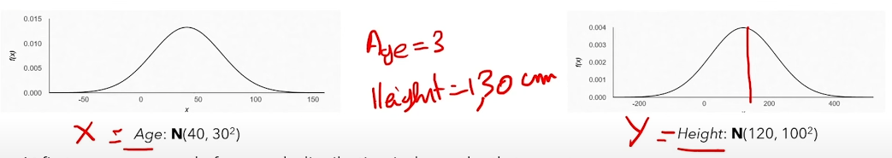

# Table of Contents

1. [How Stable Diffusion Works](#how-stable-diffusion-works)
   1. [What is it?](#what-is-it)
      - [Marginalizing a variable](#marginalizing-a-variable)
      - [Evaluating conditional probability](#evaluating-conditional-probability)

# How Stable Diffusion Works
## What is a generative model?
A generative model learns the probability distribution of a data set (images in this case) and can generate entirely new images by sampling from this distribution.

Data is modeled as distributions to be able to evaluate probabilities using conditional probability of continuous random variables (CRV). However, there is an importance on the type of distribution we use. See the example below of a normal Gaussian distribution, let's say we toss a coin for each variable (age and height). We end up with an improbable statistic of a 3 year old with a height of 130 cm. 



To solve this problem, we can use a probability density function (PDF). The Gaussian distribution is already a specific type of PDF but rather than a forced symmetric bell-curve shape around the mean, the shape will just depend on the total area of 1. This area under the PDF curve represents the probability that the variable falls within that interval. The function is f*X*(*x*) for a random variable *X*. 

In the example above, since we have two variables, we can create a **Joint Probability Distribution** graph that describes the probability distribution of the two CRVs, f*X,Y*(*x,y*) which gives the probability density at the point (*x,y*). This new graph allows us to have more a plausible statistic between age and height because the two variables of age and height now have a probability score associated with it.


Instead of evaluating each variable independently (tossing a coin for each variable), the joint distribution considers the relationship between the variables. The heatmap shown above indicates that closer to the center is a higher probability and farther is lower, representing the probability density of the two variables. With this joint distribution graph, we can evaluate probability using conditional probability or marginalizing.

***Why is this important with an image dataset?*** Well this is actually what's happening for an image, we create a very complex distribution where each pixel is a CRV and each of these pixels are joined in one big joint distribution graph. 
<br>

### Marginalizing a variable

To further analyze the relationship between age and height, we can marginalize one of the variables. Marginalizing a variable means integrating out that variable to obtain the marginal distribution of the remaining variable. For example, to find the marginal distribution of age, we integrate the joint probability density function over all possible values of height:

<pre>
f<sub>Age</sub>(a) = ∫<sub>-∞</sub><sup>∞</sup> f<sub>Age, Height</sub>(a, h) dh
</pre>

Similarly, to find the marginal distribution of height, we integrate the joint probability density function over all possible values of age:

<pre>
f<sub>Height</sub>(h) = ∫<sub>-∞</sub><sup>∞</sup> f<sub>Age, Height</sub>(a, h) da
</pre>

By marginalizing one of the variables, we can understand the distribution of the other variable independently, while still accounting for their joint relationship. In simpler terms, this means we can find out how common one variable is without considering the other variable. For example, we can determine the most common ages without worrying about heights, or the most common heights without worrying about ages.

**Real-World Example**: Imagine you have a table of data with ages and heights of children. If you want to know the overall distribution of ages without considering height, you would look at the marginal distribution of age. This tells you how common each age is, regardless of height. Similarly, the marginal distribution of height tells you how common each height is, regardless of age.
<br>

### Evaluating conditional probablity

To evaluate the probability of one variable given another, we use **conditional probability**. Conditional probability tells us the probability of one variable given that we know the value of another variable. For example, to find the probability of a certain height given a specific age, we use the formula:

<pre>
f<sub>Height|Age</sub>(h|a) = f<sub>Age, Height</sub>(a, h) / f<sub>Age</sub>(a)
</pre>

This formula means we take the joint probability of age and height and divide it by the marginal probability of age. In simpler terms, this allows us to determine the probability of a certain height given a specific age. For example, if we know a person is 130 cm tall, we can use this formula to find out the probability of different ages for a person of that height. This helps us understand the relationship between age and height more clearly.

**Real-World Example**: If you want to know the probability of a child being 130 cm tall given that they are 10 years old, you would use the joint distribution of age and height and divide it by the marginal distribution of age. This gives you the conditional probability of height given age.
<br><br>


## Forward and Reverse Process


The system will be modeled as a joint distribution with the inclusion of latent variables. Variable *Z* from the image above.

### Forward Process
We begin with the initial image, denoted as x<sub>0</sub>. In the forward process of diffusion models, we continuously add noise to this image over a series of time steps from 1 to T where x<sub>T</sub> is pure noise. At each time step t, noise is added to the image, resulting in a progressively noisier image. This can be modeled as a *Markov chain*.

The forward process in the DDPM (Denoising Diffusion Probabilistic Model) is denoted by q and involves adding noise to an image. The formula for transitioning from time step t-1 to t is as follows:

<pre>
q(x<sub>t</sub> | x<sub>t-1</sub>) = √(α<sub>t</sub>) * x<sub>t-1</sub> + √(1 - α<sub>t</sub>) * ε
</pre>

- q(x<sub>t</sub> | x<sub>t-1</sub>): "Transitioning from step t-1 to t".
- x<sub>t</sub>: The image at time step t.
- x<sub>t-1</sub>: The image at the previous time step (t-1).
- α<sub>t</sub>: The noise schedule, a value between 0 and 1 that decreases over time, controlling the amount of original image information retained at each step.
- ε: Gaussian noise sampled from a normal distribution N(0, I), representing the random noise added to the image.

As you can see from above how this this process is ***Markovian*** since the next state depends only on the previous state x<sub>t-1</sub> and some added noise.

***Note: In DDPM, α<sub>t</sub> = 1 - β<sub>t</sub>, where β<sub>t</sub> is the variance schedule that increases over time.***

Additionally, the formula for transitioning from the original image x<sub>0</sub> to x<sub>t</sub> in one step is:

<pre>
q(x<sub>t</sub> | x<sub>0</sub>) = √(α̅<sub>t</sub>) * x<sub>0</sub> + √(1 - α̅<sub>t</sub>) * ε
</pre>

- q(x<sub>t</sub> | x<sub>0</sub>): "Transitioning from original image to any step t".
- α̅<sub>t</sub> is the cumulative product of the noise schedule up to time step t.

<br>

### Reverse Process
The problem with the reverse process is that we don't have a clear mathematical formula to be able to remove the noise from the image (reverse the process) at each time step *t*. Therefore, we train a neural network to do it for us. 

In the reverse process of DDPM, we aim to remove the noise from the noisy image x<sub>t</sub> to obtain a less noisy image x<sub>t-1</sub>. This process is modeled by a neural network, denoted as p<sub>θ</sub> (P theta), which learns to predict the distribution of the previous time step's image given the current noisy image. Remember that there is no clear formula so the neural network will learn and predict the noise of μ<sub>θ</sub>(x<sub>t</sub>, t) and Σ<sub>θ</sub>(x<sub>t</sub>, t) for us. The formula is: 

<pre>
p<sub>θ</sub>(x<sub>t-1</sub> | x<sub>t</sub>) = N(x<sub>t-1</sub>; μ<sub>θ</sub>(x<sub>t</sub>, t), Σ<sub>θ</sub>(x<sub>t</sub>, t))
</pre>

- p<sub>θ</sub>(x<sub>t-1</sub> | x<sub>t</sub>): "Transitioning from noisy image x<sub>t</sub> to less noisy image x<sub>t-1</sub>".
- N: A normal distribution.
- μ<sub>θ</sub>(x<sub>t</sub>, t): The mean predicted by the neural network for the distribution of x<sub>t-1</sub> given x<sub>t</sub> and time step t.
- Σ<sub>θ</sub>(x<sub>t</sub>, t): The variance predicted by the neural network for the distribution of x<sub>t-1</sub> given x<sub>t</sub> and time step t.

The neural network p<sub>θ</sub> is trained to minimize the difference between the predicted and actual previous time step images, effectively learning to denoise the image step by step. This reverse process allows us to start from pure noise x<sub>T</sub> and iteratively remove the noise to generate a coherent image x<sub>0</sub>.

This reverse process is also Markovian, meaning that the next state (x<sub>t-1</sub>) depends only on the current state (x<sub>t</sub>) and not on any of the previous states before x<sub>t</sub>. The Markov property simplifies the modeling of the reverse process, as it ensures that each step can be treated independently given the current state.
<br>

#### ELBO Loss Function in Training the Reverse Process
In training the neural network to learn the reverse process, we use the Evidence Lower Bound (ELBO) loss. The ELBO loss helps in approximating the true distribution of the data by maximizing a lower bound on the data likelihood. This process helps the neural network learn to denoise the images accurately.

The ELBO can be broken down into two main parts:
1. The reconstruction term, which measures how well the model can reconstruct the original image from the noisy image.
2. The regularization term, which ensures that the learned distribution is close to a predefined prior distribution.

By maximizing the ELBO, we ensure that the neural network learns to generate images that are both accurate and consistent with the prior distribution.

First we start by maximizing the log likelihood of our data by marginalizing over all other latent variables. Then we find a lower bound for the log likelihood, that is log(p<sub>θ</sub>(x<sub>0</sub>)) >= ELBO. As you can see, maximizing the ELBO also indirectly maximizes the log likelihood of the data.

In summary, the ELBO loss provides a way to train the neural network for the reverse process by balancing the reconstruction accuracy and the regularization, ensuring that the generated images are both realistic and consistent with the prior distribution.

##### Real-World Analogy
Consider a real-world scenario where a company's revenue is always greater than or equal to its sales. If we aim to maximize the sales, the revenue will naturally increase as well. Similarly, by maximizing the ELBO, we are indirectly maximizing the likelihood of the observed data, leading to better performance of the neural network in the reverse process.
<br><br>

## Algorithms

## Training Loop


In simpler terms, the training loop for Denoising Diffusion Probabilistic Models (DDPM) involves the following steps:

1. **Sample an Image**: We start by taking a sample image (or batches) from our dataset, denoted as x<sub>0</sub>.
2. **Select a Random Time Step**: We randomly choose a time step t from a uniform distribution between 1 and T.
3. **Generate Random Noise**: We generate random noise ε (epsilon) from a normal distribution with mean 0 and variance 1.
4. **Add Noise to the Image**: We add the generated noise to the image (or each images) at time step *t* using the formula:
   <pre>
   x<sub>t</sub> = √(α̅<sub>t</sub>) * x<sub>0</sub> + √(1 - α̅<sub>t</sub>) * ε
   </pre>
   Here, α̅<sub>t</sub> is a predefined noise schedule that controls the amount of noise added at each time step.
5. **Train the Model**: We train the neural network to predict the noise added to the image by minimizing the difference between the actual noise and the predicted noise. This is done using gradient descent on the loss function:
   <pre>
   ∇<sub>θ</sub> || ε - ε<sub>θ</sub>(√(α̅<sub>t</sub>) * x<sub>0</sub> + √(1 - α̅<sub>t</sub>) * ε, t) ||<sup>2</sup>
   </pre>
   Here, ε<sub>θ</sub> is the noise predicted by the neural network, and θ represents the parameters of the neural network. Remember that theta comes from the reverse process.
   
   The formula can be broken down as follows:
   - ε: The actual noise added to the image.
   - ε<sub>θ</sub>(√(α̅<sub>t</sub>) * x<sub>0</sub> + √(1 - α̅<sub>t</sub>) * ε, t): The noise predicted by the neural network given the noisy image and the time step t.
   - ε<sub>θ</sub>: The model as it represents the neural network's prediction of the noise, parameterized by θ.
   - || ε - ε<sub>θ</sub>(...) ||<sup>2</sup>: The squared difference between the actual noise and the predicted noise, which we aim to minimize.
   - ∇<sub>θ</sub>: The gradient with respect to the neural network parameters θ, used for updating the model during training.

   Simplified, the goal is to adjust the neural network parameters θ so that the predicted noise ε<sub>θ</sub> closely matches the actual noise ε. By minimizing this loss, we are able to maximize the ELBO, ensuring the neural network learns to denoise the images effectively.
6. **Repeat Until Convergence**: We repeat the above steps until the model converges, meaning the predictions become accurate enough.

By following these steps, the model learns to denoise images step by step, starting from pure noise and gradually reconstructing the original image.
<br><br>

## Denoising U-Net


The U-Net architecture processes the image through three main paths: downsampling, bottleneck, and upsampling. Here's a simplified explanation of how the image moves through the U-Net:

1. **Downsampling Path (Encoder)**:
   - The noisy image enters the U-Net and passes through a series of convolutional layers.
   - Each layer reduces the spatial dimensions (width and height) while increasing the number of channels.
   - This process captures increasingly abstract features of the image.
   - The image's representation becomes more compact but richer in information.

2. **Bottleneck**:
   - The image reaches its most compressed form at the bottom of the 'U'.
   - Here, the model processes the most abstract representation of the image.
   - This is where the model can make global decisions about the image content.

3. **Upsampling Path (Decoder)**:
   - The process reverses, gradually increasing spatial dimensions and decreasing channel depth.
   - Skip connections from the downsampling path provide additional context.
   - These connections help preserve fine details that might have been lost during downsampling.
   - The image is progressively reconstructed, removing noise at each step.

Throughout this process, the U-Net is working in the latent space, which is a compressed representation of the image. This latent space can be thought of as a high-dimensional vector where each dimension represents a particular feature or attribute of the image. The U-Net's job is to move the noisy image's position in this latent space towards a position that represents a clean, noise-free version of the image.

---

### Conditioning the Reverse Process (Training)

From the training loop algorithm, the loss function contains the model ε<sub>θ</sub>. This model will be built using a denoising U-Net.

In the reverse process of the training loop, the denoising U-Net plays a crucial role in removing the noise added to the images at each time step. By predicting the noise component ε<sub>θ</sub>, the U-Net helps in reconstructing the image step by step, gradually refining it to resemble the original image or a target prompt. 

To generate images that align with specific prompts or conditions, we need to guide the reverse process. There are two main approaches to achieve this: classifier guidance and classifier-free guidance.
<br>

---

##### Classifier Guidance

In classifier guidance, an additional classifier is trained to predict the class or attributes of an image. This classifier is then used to guide the reverse process:

1. **Classifier Training**: A separate classifier is trained on the dataset to recognize specific classes or attributes.
2. **Gradient-based Guidance**: During the reverse process, the gradient of the classifier's output with respect to the image is used to steer the denoising process towards the desired class or attributes.
3. **Iterative Refinement**: At each denoising step, the U-Net's output is adjusted based on the classifier's gradient, pushing the image towards the desired outcome.

---

##### Classifier-Free Guidance

Classifier-free guidance, on the other hand, doesn't require a separate classifier. Instead, it uses a single network trained to handle both conditioned and unconditioned generation:

1. **Training Process**: During training, with some probability, the conditional signal (e.g., text prompt) is set to zero or a null token.
2. **Dual Outputs**: As a result, the network learns to produce both conditioned and unconditioned outputs.
3. **Guidance Scale**: During inference, both the conditioned and unconditioned outputs are generated and then combined using a guidance scale parameter.
4. **Weighted Combination**: The final output is a weighted combination of the conditioned and unconditioned predictions, where the weight (guidance scale) determines how much influence the conditioning signal has.

The combine output formula for classifier-free guidance is typically expressed as:

z<sub>guided</sub> = z<sub>uncond</sub> + w * (z<sub>cond</sub> - z<sub>uncond</sub>)

Where:
- z<sub>guided</sub> is the final guided output
- z<sub>uncond</sub> is the unconditioned output
- z<sub>cond</sub> is the conditioned output (based on the prompt)
- w is the guidance scale (weight)

The guidance scale w controls how much the model pays attention to the conditioning signal (prompt):
- When w = 0, the output is purely unconditioned (ignores the prompt)
- When w = 1, it's a balanced mix of conditioned and unconditioned outputs
- When w > 1, it emphasizes the conditioned output, potentially leading to stronger adherence to the prompt but possibly less diverse or realistic results

Adjusting this guidance scale allows fine-tuning of the generation process, balancing between prompt adherence and image quality or diversity.
<br><br>

## CLIP Encoder


To be able to condition and guide the denoising U-Net to an image using a prompt, we use something called a CLIP (Contrastive Language-Image Pre-training) Encoder. The encoder will embed (vectors that represent the meaning) a text prompt and an image prompt into a shared latent space. This helps understand the meaning of images using descriptions.

In the example above, you can see Image of *I* from 1 to N is matched with the descriptions of Text *T* from 1 to N. The matrix is built by the dot product of the Image *I* per row from 1 to N multiplied with all of the text embeddings. It is trained by a loss function that maximizes the value of the diagonal matches (blue squares) while the rest of the values are 0 (grey squares). The model will be able to learn to match the description of an image with the image itself. 

For stable diffusion, only the text encoder will be used to embed the text prompt. In this case, the U-Net will use the embeddings as conditioning signals to guide the image to look like the prompt in each denoising step (see the reverse process).  
<br><br>

## Auto Encoder


The autoencoder is a network that given an image will transform into a vector (*Z*) that is much smaller than the original image. Think of it as compressing a file into a zip folder. When we pass the vector through the decoder it will re-build the original image back.

The problem with autoencoders is that the code learned by the model has no sense to it. It does not capture any semantic relationships between the data. We can keep assigning vectors to the input and the code does not find any pattern associated with the images. For example, we may end up seeing that an image of a cat is very close together in vector space with an image of a pizza. 
<br>

---

### Variational Auto Encoder (VAE)


To solve the problems of autoencoder we introduce a variational autoencoder, so rather the model learning code, we learn something called a ***latent space***. The latent space represents the parameters of a multivariate or joint distribution. From here we are able to capture semantic relationships between images. The embeddings in the vector space will be close together with vectors that closely match each other such as animals, food, buildings, etc.
<br>

---

### Latent Diffusion Model

Stable Diffusion is a latent diffusion model (LDM), from what was mentioned in the beginning, a generative model learns the distribution p(x) of a dataset of images. However, an LDM learns the distribution of a *latent* representation of the dataset by using a Variational Autoencoder (VAE).

VAE will help reduce the computation complexity by compressing the images of the dataset from lets say a 512x512 image to a latent representation that is 64x64. 
<br><br>


## Full Architecture Combined
### Text-To-Image


The full architecture of the text-to-image process in Latent Diffusion Models (LDMs) can be broken down into the following simplified steps:

1. Text Encoding (CLIP Text Encoder):
   - The input text prompt is processed by the CLIP Text Encoder.
   - This encoder converts the text into a latent representation that captures its semantic meaning.

2. Random Noise Generation (VAE):
   - A random noise tensor is generated in the latent space (*Z*) using the VAE.
   - This serves as the starting point for the image generation process.

3. Denoising Process (U-Net):
   - The U-Net, which is the core of the diffusion model, iteratively denoises the latent representation.
   - It takes four inputs:
     a. The noisy latent image
     b. The timestep (indicating the level of noise)
     c. The encoded text prompt from step 1
     d. The scheduler's current parameters such as time embeddings
   - The U-Net predicts the noise to be removed at each step to guide it to the image of the prompt.
   - The scheduler then guides the denoising process, determining the step size and noise level for each iteration, for example, in the next    iteration, we may skip 20 time steps from 1000 to 980. We continue until there are no more noises in the image.

5. Conditioning and Guidance:
   - The text embeddings from the CLIP Text Encoder guide the denoising process.
   - This ensures that the generated image aligns with the input text prompt.
   - The scheduler may adjust the strength of this guidance based on its parameters.

6. Latent Space to Image (VAE Decoder):
   - Once the denoising process is complete, the final latent representation is passed through the VAE Decoder.
   - The VAE Decoder converts the latent representation back into a full-resolution image.

Key components:
- CLIP Text Encoder: Processes the input text prompt
- U-Net: Performs the iterative denoising in latent space
- VAE Decoder: Converts the final latent representation to an image
- Scheduler: Manages the denoising process, controlling noise levels and step sizes

This process combines the efficiency of working in a compressed latent space (thanks to the VAE) with the power of diffusion models and the semantic understanding provided by CLIP, resulting in high-quality, text-guided image generation.
<br>

---

### Image-To-Image


The image-to-image process in Latent Diffusion Models (LDMs) follows a similar architecture to the text-to-image process, with some key differences. Here's a simplified breakdown of the steps:

1. Image Encoding (VAE):
   - The input image is processed by the VAE Encoder. (differs with text-to-image where its just a random noisy latent image)
   - This encoder converts the image into a latent representation in the compressed latent space.

2. Text Encoding (CLIP Text Encoder):
   - If there's an accompanying text prompt, it's processed by the CLIP Text Encoder.
   - This step is similar to the text-to-image process, converting text into a semantic latent representation.

3. Noise Addition to Image Encoding (VAE):
   - Instead of starting with pure random noise, the encoded latent input image is partially noised.
   - The amount of noise added depends on the strength parameter, allowing for varying degrees of transformation.

4. Denoising Process (U-Net):
   - The U-Net performs iterative denoising on the noisy latent image.
   - It takes four inputs:
     a. The noisy latent image
     b. The timestep (indicating the level of noise)
     c. The encoded text prompt (if provided)
     d. The scheduler's current parameters
   - The U-Net predicts the noise to be removed at each step, guided by both the input image and text prompt.
   - Remember that the denoising process could change depending if its classifier guidance or classifier-free guidance.

5. Conditioning and Guidance:
   - The text embeddings (if provided) guide the denoising process.
   - The initial image's features also influence the generation, maintaining relevant aspects of the original image.
   - The scheduler adjusts the denoising process based on the strength parameter and other settings.

6. Latent Space to Image (VAE Decoder):
   - After denoising, the final latent representation is passed through the VAE Decoder.
   - The VAE Decoder converts the latent representation back into a full-resolution image.

Key components:
- VAE Encoder: Converts the input image to latent space with noise
- CLIP Text Encoder: Processes the optional text prompt
- U-Net: Performs the iterative denoising in latent space
- VAE Decoder: Converts the final latent representation to an image
- Scheduler: Manages the denoising process, controlling noise levels and step sizes

The image-to-image process allows for controlled transformation of existing images, guided by both the input image's features and optional text prompts. This enables various applications such as style transfer, image inpainting, and targeted image editing.


<br><br><br>
# Process Overview of Stable Diffusion
1. Autoencoder:
- Encoding: The initial image is encoded into a latent space using an autoencoder.
- Components: This autoencoder consists of an encoder that compresses the image into a latent representation and a decoder that can reconstruct the image from this latent representation.

2. Latent Space Representation:
- The image, now represented in a compressed latent space, can be more efficiently processed for tasks like denoising.
- This latent representation retains essential features and context of the image but in a lower-dimensional space, making subsequent processing computationally more efficient.

3. Denoising U-Net with Attention Mechanisms:
- The latent representation is fed into a U-Net architecture, enhanced with self-attention and cross-attention blocks, which is used for the denoising process in the diffusion model.
- Self-Attention Blocks: Capture long-range dependencies and contextual information within the same resolution level.
- Cross-Attention Blocks: Enable interaction between different resolution levels and between the latent image features and textual features from the CLIP model.

4. Diffusion Process:
- The diffusion process involves adding noise to the latent representation (forward process) and then iteratively denoising it (reverse process).
- **DDPM** (Denoising Diffusion Probabilistic Models): The forward process gradually adds Gaussian noise, and the reverse process probabilistically denoises the image using a U-Net.
- **DDIM** (Denoising Diffusion Implicit Models): Similar to DDPM but uses a non-Markovian and potentially deterministic approach for the reverse process, allowing for more efficient and consistent denoising with fewer steps.

5. Guidance with CLIP:
- In guided diffusion models, mechanisms like CLIP are used to ensure the generated image aligns with a text prompt.
- Text Encoding: The text prompt is encoded into a latent vector using the CLIP text encoder.
- Image Encoding: Intermediate images are encoded into latent vectors using the CLIP image encoder.
- Comparison and Adjustment: The CLIP latent vectors of the image and text prompt are compared, guiding the U-Net’s denoising steps to ensure the final output accurately reflects the text description.

6. Reconstruction:
- After the denoising process, the refined latent representation is passed through the decoder part of the autoencoder.
- The decoder reconstructs the final image from the denoised latent representation.

## Detailed Breakdown
1. Encoding with Autoencoder:
- Input Image: The process starts with an input image.
- Encoder: The encoder compresses this image into a latent representation, capturing essential features and context.

2. Diffusion Process in Latent Space:
- Noise Addition: Noise is added to the latent representation.
- U-Net Denoising with Attention: The noisy latent representation is iteratively denoised by the U-Net.
  - Self-Attention Blocks: Capture and enhance features by considering dependencies within the same resolution level.
  - Cross-Attention Blocks: Facilitate the integration of textual features (from CLIP) with image features, and enable interactions between different resolutions.

3. Guidance (if applicable):
- CLIP Encoding: Both the intermediate latent representation and the text prompt are encoded using CLIP.
- Comparison and Adjustment: The CLIP latent vectors are compared to guide the U-Net’s denoising steps, ensuring alignment with the text prompt.

4. Reconstruction with Decoder:
- Final Latent Representation: After iterative denoising, the final latent representation is obtained.
- Decoder: This representation is decoded back into the image space to produce the final output.

## Simplified Visualization
```
Input Image
   |
[Autoencoder Encoder]
   |
Latent Representation (compressed)
   |
[Diffusion Process in Latent Space with Self-Attention and Cross-Attention]
   |   \
Noise   Denoising (U-Net with Attention)
   |     /
Intermediate Latent Representations (iteratively refined)
   |
Final Latent Representation
   |
[Autoencoder Decoder]
   |
Final Image
```